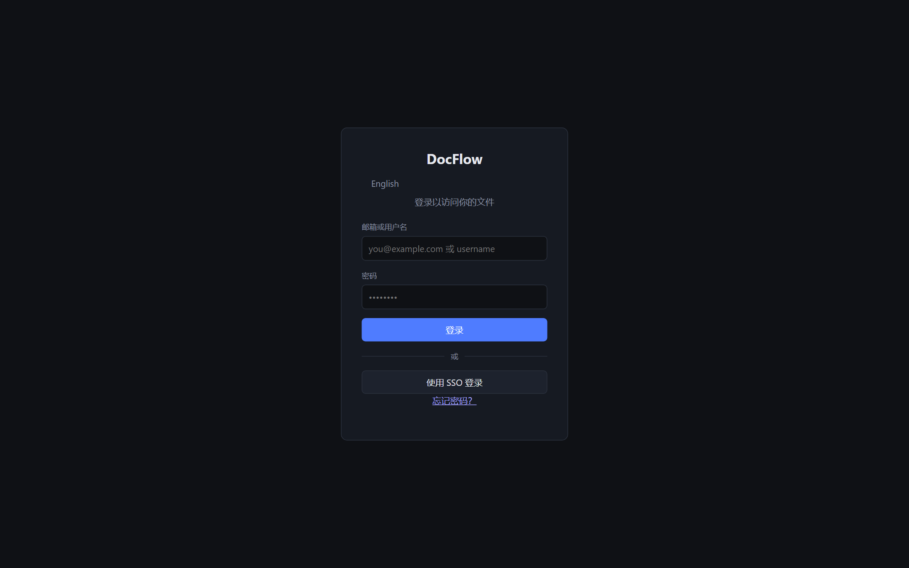
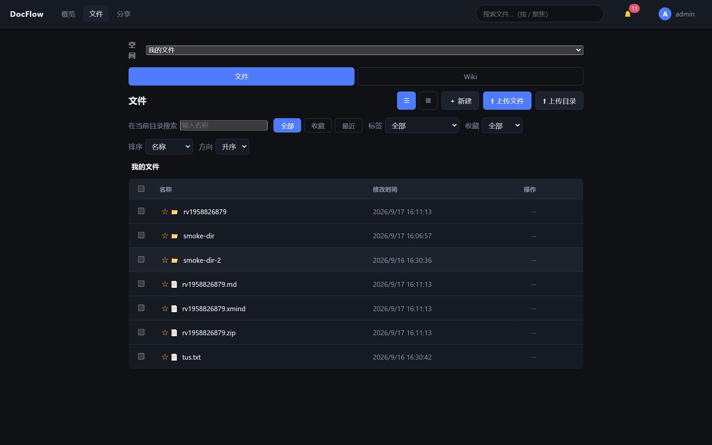
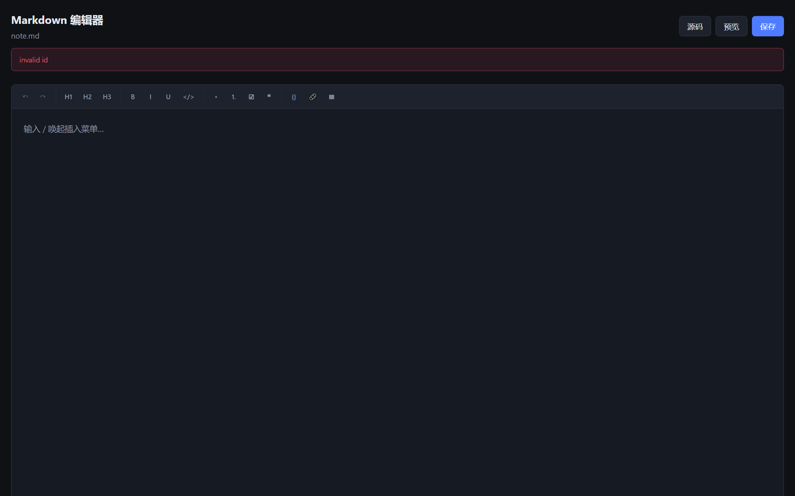
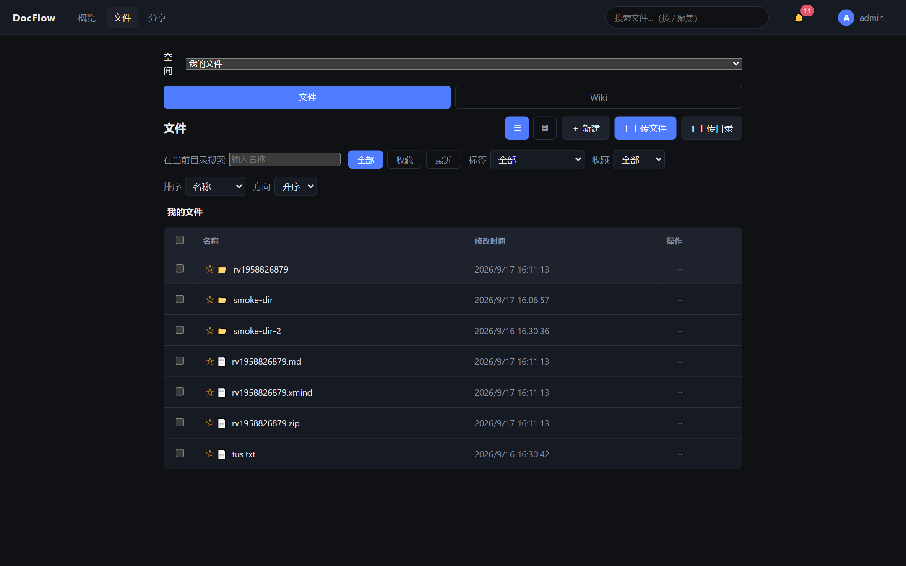
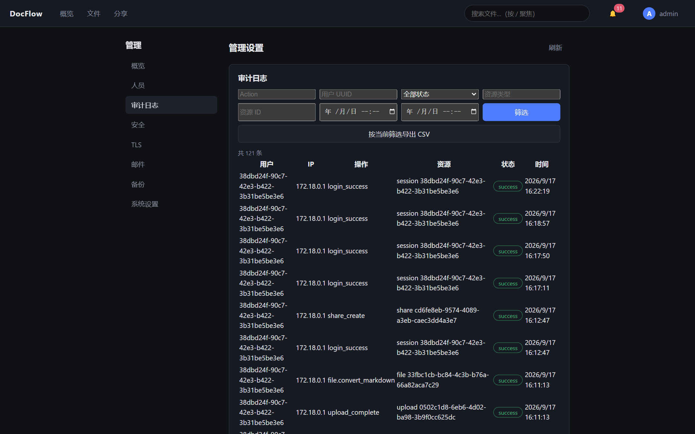
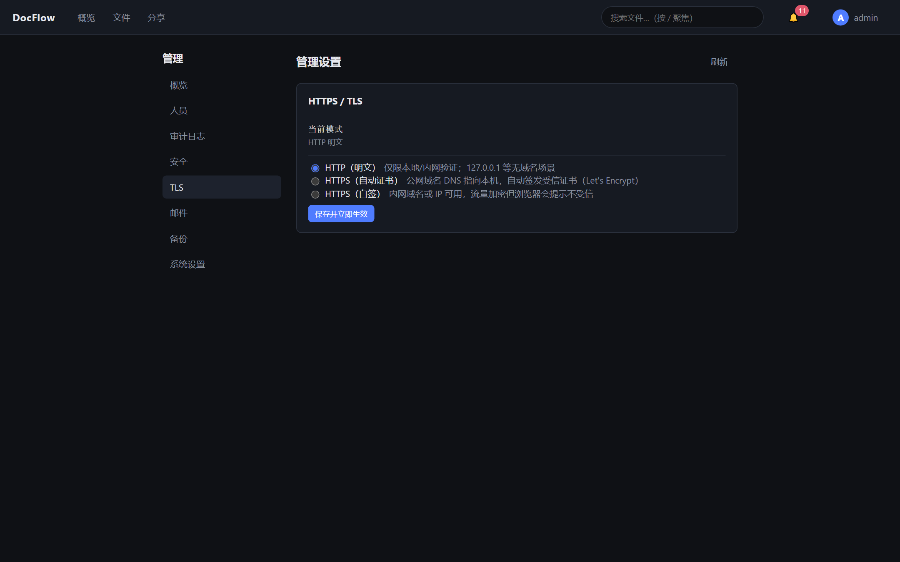
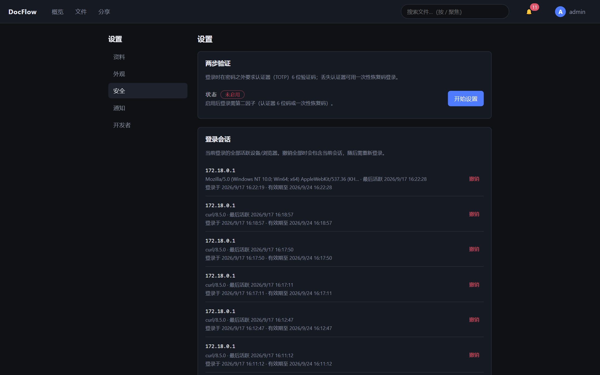

# DocFlow

自托管的企业级文档与文件管理平台：团队空间、细粒度权限、断点续传上传、在线编辑（OnlyOffice / draw.io / Excalidraw）、全文搜索、病毒扫描、OIDC 单点登录与完整审计。

- 后端：Go 1.22（Gin + GORM），PostgreSQL 16，增量 SQL 迁移
- 前端：React 18 + TypeScript + Vite（PWA），构建产物并入 Caddy 镜像，无独立前端容器
- 部署：docker compose 一键起，caddy 为唯一宿主端口（80/443）

## 界面预览

| | |
|---|---|
|  |  |
|  |  |
|  |  |
|  |  |

## 功能特性

**文件管理**
- tus 协议断点续传上传、分片与秒传（SHA-256 去重）
- 文件版本链（上限可配、自动裁剪）、回收站与保留期清理
- 批量操作（移动/删除/下载 zip）、配额管理、标签与收藏
- 网页包（zip）安全预览：严格 CSP 沙箱 + 解包限制 + 独立内容 origin

**协作与分享**
- 团队空间：目录级 ACL、自定义角色与权限范围
- 外链分享：密码保护、有效期、水印、访问事件审计
- WebSocket 实时通知（多实例经 Redis Pub/Sub 广播）

**集成**
- OnlyOffice Document Server（JWT 回调闭环、版本落库、防 SSRF）
- draw.io 图表编辑、Excalidraw 白板、内置 Monaco 文本/源码编辑器（VSCode 同款，明暗主题跟随）
- ClamAV 病毒扫描（fail closed、隔离与拒收）
- 全文搜索：PostgreSQL 原生或 Meilisearch（可切换）
- OIDC 单点登录（授权码 + PKCE，自动开户）
- SMTP 邀请注册 / 密码重置、Webhook 事件推送

**AI 能力（可选启用）**
- 多 Provider 网关（平台管理 → AI 设置）：OpenAI 兼容（OpenAI / DeepSeek / Qwen / Ollama / vLLM）、Anthropic、Mock；每 Provider 多模型 + 能力勾选（对话 / 向量 / 视觉图片 / 重排序）、Provider 级限流（次/分钟、日配额）与全局兜底限流、温度与 max_tokens、用量统计（按用户/Provider/模型聚合）、测试连接
- 场景默认模型（对话 / 摘要 / 编辑器 / 向量，摘要与编辑器可回落对话默认）；`ai.enabled` 总开关：关闭后全站隐藏 AI 入口、网关 404
- 双轨制：个人可自备 Provider（设置 → AI 个人配置，Key 掩码不回显、默认模型与人设、「优先使用我的模型」开关，命中个人池跳过平台限流）
- RAG 检索增强：关键词 / 混合（关键词 + 向量）模式，向量库 Qdrant（`--profile ai-vector`）；embedding 模型从 Provider 池勾选向量能力模型，热切换免重启（collection 按 provider + 模型派生，切换后管理端一键「重建向量索引」）；rerank 重排（Cohere / Jina 兼容 /rerank 协议，失败静默原序）；chunk / top-k / overlap 可配
- 联网搜索：`--profile ai-search` 启 SearXNG 或配置 Tavily Key；对话可开「联网」，来源以引用展示，8s 超时静默降级
- 思考推理：对话「思考」开关，openai reasoning_effort / anthropic thinking 参数透传
- AI 助手与编辑器对话：GPT 式抽屉（气泡 / 停止 / 建议 / 模型选择 / 图钉固定）；编辑页对话可直接修改文档（可修改|仅对话模式，自动应用前存版本、消息级撤销）；三处对话（助手 / 编辑页 / 创作空间）共享联网·思考·MCP 开关
- AI 记忆：手动增删改 + 自动提取长期偏好（个人开关、去重、上限 100 条）；对话注入最近 20 条（总量 6000 字符截断）
- 人设与技能：平台人设（system 提示模板，全员可选）+ 个人人设；平台技能模板（快捷指令，`{selection}`/`{file}` 占位符，助手与编辑页对话可用）
- 图片 OCR：索引管道自动调视觉模型提取图片文字，入全文 + 向量索引（单图上限 1-32MB 可配、热配置）
- MCP 双向：自身作为 MCP Server 对外暴露文档工具（见 [docs/mcp.md](docs/mcp.md)）；作为客户端消费外部 MCP 服务器（平台配置 ≤8 个 Streamable HTTP 服务 + 鉴权头，对话「MCP 工具」开关，工具调用 ≤5 轮、流式展示）
- AI 创作空间（顶部入口）：项目绑定空间目录、多会话持久化、目录树 / 任务列表、Skill 创作模板（建站落地页 / 项目文档 / 接口文档 / 思维导图大纲 / PPT 大纲 / 数据报表）、Agent 任务创建 → 轮询 → Diff 评审 → 应用 / 放弃 / 回滚

**安全与运维**
- TOTP 两步验证、会话管理、PAT 个人访问令牌、登录限流与锁定
- 审计日志、Prometheus 指标、/ready 六项就绪探针
- 备份 / 恢复脚本与校验和验证

## 架构与服务矩阵

| Profile | 服务 | 说明 |
|---|---|---|
| minimal | caddy + backend + postgres | 基础栈，`make up-minimal` |
| full | + redis + onlyoffice + drawio | `make up-full`（队列 / WS 广播 / 在线编辑） |
| antivirus | + clamav | 病毒扫描，叠加 `--profile antivirus` |
| search | + meilisearch | 全文搜索，叠加 `--profile search` |
| storage | + minio | S3 对象存储，叠加 `--profile storage` |
| ai-vector | + qdrant | 混合检索向量库，`docker compose --profile ai-vector up -d` |
| ai-search | + searxng | AI 联网搜索，`--profile ai-search` |

## 打包

两个自建镜像，均由 compose 构建（`docker compose build` 或随 `up --build`）：

| 镜像 | 构建上下文 | 内容 |
|---|---|---|
| `docflow/backend:1.0.0` | `./`（Dockerfile） | Go 多阶段构建：`/docflow` 服务、`/migrate`、`/seed`，含 migrations |
| `docflow/caddy:1.0.0` | `./frontend`（frontend/Dockerfile） | 前端 Vite 构建产物 → Caddy 静态托管 + 反代（TLS 自动签发） |

推送到镜像仓库后即可在任意装了 docker compose 的主机部署：

```bash
docker build -t <registry>/docflow-backend:1.0.0 .
docker build -t <registry>/docflow-caddy:1.0.0 ./frontend
docker push <registry>/docflow-backend:1.0.0 <registry>/docflow-caddy:1.0.0
```

## 部署（生产）

### 从源码一键部署

无需预先存在 DocFlow 镜像，部署入口会校验 Docker Compose、创建（但不覆盖）`.env`、构建前端/Caddy 与 backend 镜像，并按 `postgres → migrate → seed → backend → caddy` 依赖顺序启动：

```bash
# 首次运行会复制 .env.example 后提示补齐密钥，再次运行即可
make deploy-minimal
make deploy-full
# 或直接执行：powershell -NoProfile -ExecutionPolicy Bypass -File scripts/deploy.ps1 -Profile minimal
```

脚本要求在已有 `.env` 中设置随机的 `JWT_SECRET`、`POSTGRES_PASSWORD`、`SEED_ADMIN_PASSWORD`，不会把真实密钥写入仓库。访问地址默认是 `http://localhost/`；默认账号由 `SEED_ADMIN_EMAIL`/`SEED_ADMIN_USERNAME` 和 `SEED_ADMIN_PASSWORD` 决定，首次登录后请立即改密。

`minimal` 仅启动 caddy、backend、PostgreSQL；`full` 额外启动 Redis 和 OnlyOffice。ClamAV、Meilisearch、MinIO 分别使用 `antivirus`、`search`、`storage` profile 叠加。AI 能力默认关闭，关闭时不依赖任何外部服务；启用 RAG 向量检索需叠加 `--profile ai-vector` 启动 Qdrant，并在 AI 设置中开启向量检索、勾选 embedding 模型（Qdrant 只提供存储服务，不会自动启用 AI）；启用联网搜索可叠加 `--profile ai-search` 启动 SearXNG，或仅配置 Tavily Key（无需额外服务）。

镜像标签由 `DOCFLOW_IMAGE_TAG` 配置，backend、migrate、seed 和 caddy 使用同一标签。检查构建配置可执行 `make validate-compose`（等价于 `docker compose config --quiet`）。

三步：

```bash
# 1. 配置：从生产模板生成 .env，替换全部 CHANGE_ME 占位符
cp .env.production.example .env
vi .env   # JWT_SECRET / POSTGRES_PASSWORD / SEED_ADMIN_PASSWORD / APP_DOMAIN 等

# 2. 启动（推荐 full；按需叠加 antivirus/search/storage profile）
make up-full                                  # 或
docker compose --profile full --profile search --profile storage --profile antivirus up -d --build

# 3. 验证
curl -sf https://<你的域名>/ready    # {"status":"ready"} 六项检查全 ok
```

首次启动自动执行：数据库迁移（migrate）→ 初始管理员引导（seed，幂等）→ backend 健康后 caddy 放行流量。

要点：

- `.env.production.example` 内含每个 profile 的联动开关与密钥生成指引，模板可用 `scripts/prod-env-check.sh` 校验
- S3（storage profile）需先建 bucket（模板注释中有 mc 命令）；多实例部署必须 `QUEUE_DRIVER=redis` + `STORAGE_DRIVER=s3`
- OIDC 开启时 backend 与 IdP 强耦合：discovery 失败会拒绝启动（自带 restart 自愈）
- 停止：`make down`（含全部 profile；加 `-v` 清数据卷）
- 备份：`make backup` / `make backup-verify`（Windows 用 `backup-windows` 系）

## AI、Agent 与 WebDAV 使用说明

### AI 助手与 AI 智能体的区别

- **AI 助手**：面向当前页面的即时问答、摘要、润色、翻译和选区改写；不会自行执行多步文件操作。
- **AI 智能体**：面向空间目录的复杂任务，例如创建 Web 项目、批量整理文档、生成图表和演示文稿。任务先创建目录快照，Agent 在受限 Docker workspace 中执行，产物先生成 Diff，用户确认后才写回平台。
- Agent 默认关闭。启用后仍需配置镜像白名单、资源限制和 Docker runtime；平台不会把宿主机任意目录或 Docker Socket 暴露给 Agent。

### 空间目录与 Agent 工作区

Agent 不直接把数据库对象目录挂给容器，也不直接让容器改平台文件。推荐流程是：

```text
平台空间目录 → 任务快照 → 临时 Docker workspace → Agent 修改 → Diff/预览 → 用户确认 → 平台上传/新版本
```

这样可以保留平台 ACL、病毒扫描、配额和版本链。当前不把 Git 作为平台底层存储；如果需要代码分支，可在 Agent workspace 内使用 Git，但最终通过 Diff 和平台版本写回。平台目录级快照负责跨文件回滚，比把数据库目录直接 Git 化更安全。

### WebDAV 挂载

在“设置 → WebDAV”创建一次性令牌。挂载地址为：

```text
https://你的域名/webdav
```

Basic Auth 用户名使用平台邮箱/用户名，密码使用创建时显示一次的 WebDAV 令牌。令牌只存哈希，丢失后只能吊销并重新创建。

- Windows：文件资源管理器 → 此电脑 → 映射网络驱动器 → 输入 WebDAV 地址。
- Linux：安装 `davfs2` 后使用 `mount -t davfs https://域名/webdav /mnt/docflow`。
- macOS：Finder → 前往 → 连接服务器 → 输入 WebDAV 地址。

WebDAV 默认关闭；管理员需要在部署配置中设置 `webdav.enabled=true`，并在设置页创建令牌。

### 部署文档位置

部署入口、源码构建、Profile、网络镜像源和环境变量说明集中放在本 README；API 细节见 `docs/openapi.yaml`，运行配置见 `.env.example` 和 `.env.production.example`。

### 富文本多人实时协作

`.dfrt` 富文本编辑页内置多人实时协作（ProseMirror prosemirror-collab 权威排序模型，服务端 `internal/collab`）：

- 同一文件的多个编辑页自动进入同一协作房间：实时同步编辑内容、远程光标（彩色竖线+名字）、在线成员头像与 leader 标记。
- 后加入者不落磁盘旧文档：服务端短暂暂停编辑（sync-begin），由 leader 冲账上报实时文档快照，原子转正（init-doc）后恢复（sync-end），保证所有人从同一起点收敛。
- leader（最早加入者）每 3 秒自动保存；leader 离开自动转移。断线重连后若版本漂移（无历史 steps 追赶），会明确提示刷新页面完成同步，绝不静默错版。
- 权限：加入房间前按文件编辑权限校验（复用与 WebDAV/OnlyOffice 保存同源的写权限链）；`collab.enabled` 系统设置可整体关闭（默认开启）。
- 已知边界：房间为单实例内存态（多实例部署需按文件粘性会话）；同一用户多标签页显示为多个成员。

## 本地开发

```bash
# 后端（:8080）：先自备 PostgreSQL 或临时容器
docker run -d --name docflow-pg -p 5432:5432 \
  -e POSTGRES_DB=docflow -e POSTGRES_USER=docflow \
  -e POSTGRES_PASSWORD=change-me postgres:16-alpine
cp .env.example .env   # 本地默认值开箱可用
make run

# 前端（:5173，/api 代理到 :8080）
cd frontend && npm install && npm run dev
```

常用命令：`make test`（单测）、`make e2e`（Playwright 端到端）、`make fmt`、`make migrate`、`make seed`。

## 配置

- 全量配置参考：[docs/configuration.md](docs/configuration.md)（启动级环境变量 + 运行时设置键）
- 全量键说明：[.env.example](.env.example)（逐键注释）
- 生产推荐值：[.env.production.example](.env.production.example)（profile 联动矩阵）
- API 契约：[docs/openapi.yaml](docs/openapi.yaml)

## 目录结构

```
cmd/            server / migrate / seed / backup-verify / wscheck
internal/       业务模块（auth/files/share/team/upload/search/oidc/...）
migrations/     增量 SQL（按文件名序执行，幂等）
frontend/       React SPA 与 E2E
deploy/         Caddyfile（TLS / 反代 / 子路径规则）
scripts/        备份恢复、集成验证（meili/s3/smtp/clamav/onlyoffice/oidc）、冒烟
docs/           OpenAPI
```

## License

[Apache-2.0](LICENSE)
